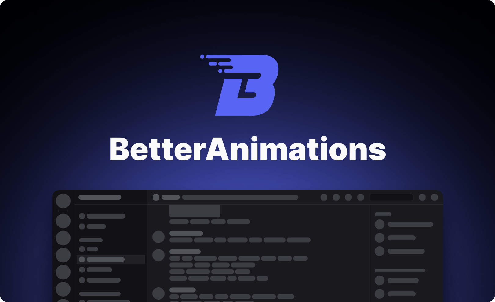
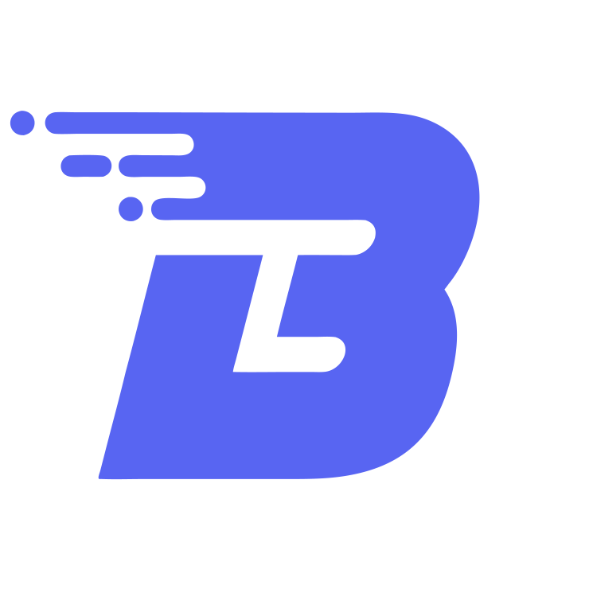

> [!WARNING]
> This project is currently in Closed Beta.



<h3 align="center">Discord Animations Client Mod & Framework</h3>
<p align="center">Bring your Discord app to life — tweak, create, animate. A BetterDiscord plugin.</p>
<p align="center">
    
    
</p>
<p align="center">
  <a href="https://betterdiscord.app/plugin/BetterAnimations">BetterDiscord</a>
  <span>&nbsp;&nbsp;•&nbsp;&nbsp;</span>
  <a href="https://discord.gg/M8DBtcZjXD">Support Server</a>
  <span>&nbsp;&nbsp;•&nbsp;&nbsp;</span>
  <a href="https://donationalerts.com/r/arg0nny">Donate</a>
</p>

## Installation

Install [BetterDiscord](https://betterdiscord.app/) and download the latest release of _BetterAnimations_ from [Releases](https://github.com/arg0NNY/BetterAnimations/releases).

See [Installing Addons](https://docs.betterdiscord.app/users/guides/installing-addons) for more info.

## Documentation

Visit the Usage and Animation Authoring documentation at
<a href="https://docs.betteranimations.net/" target="_blank">
    docs.betteranimations.net
</a>

## Roadmap

### Beta

- [ ] Migrate to Zod 4 (improve performance & reduce bundle size)
- [ ] Animation Preview
- [ ] Catalog & Library
- [ ] Integrate `ErrorBoundary` for better error safety
- [ ] Integrate Expression Picker to [_Popouts_](https://docs.betteranimations.net/usage/modules#popouts)
- [ ] Expand [Injects](https://docs.betteranimations.net/create/injects)
  - [ ] Add more [Array Injects](https://docs.betteranimations.net/reference/injects/array)
  - [ ] Add more [Anime Injects](https://docs.betteranimations.net/reference/injects/anime)
- [ ] General Settings
  - [ ] Switch Cooldown Duration
  - [ ] Cross-window Support Toggle (Call Popout, Game Overlay)
  - [ ] Hints Toggle
- [ ] Pack Changelogs
- [ ] [BetterAnimations V1](https://github.com/arg0NNY/DiscordPlugins/tree/fa45fb514aa7a8febe4ddd143a08ff1c9f124fe0/BetterAnimations) Settings Migrator

### Stable

- [ ] Settings Preview Mode
- [ ] Custom Animation Settings
- [ ] Revamp Animation Settings
  - [ ] Position
  - [ ] Direction
- [ ] Migrate to TypeScript

## Development

This project uses [pnpm](https://pnpm.io/) as a primary package manager.

Run the following commands to build the plugin:
```sh
pnpm install
pnpm dev
```

The bundle should be automatically put in your _BetterDiscord Plugins_ folder. If not, copy it manually from `dist`.
