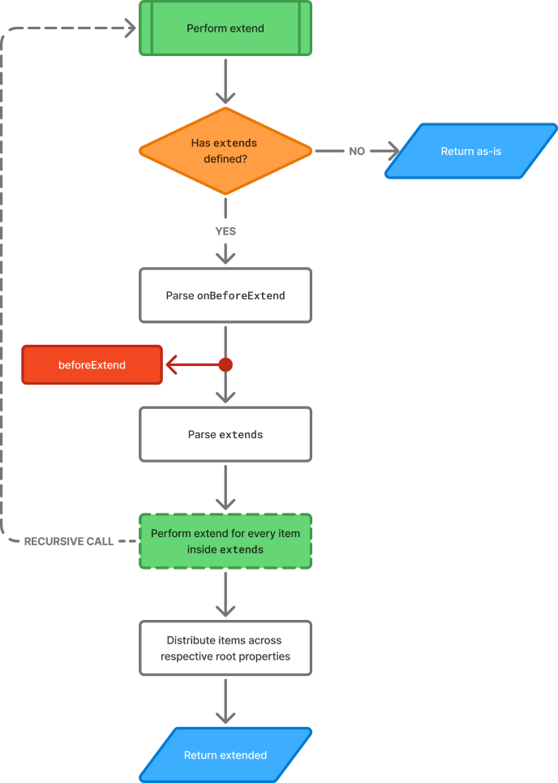

# Extending Animations

_BetterAnimations_ provides an ability to extend Animations.
It may be useful in a variety of cases — building composite animations, making animation definitions cleaner
by reusing them, using premade animations as a base for your own — and much more.

## Basics

Provide [Animate](/reference/animate) definitions you want your Animation to be extended from
to [`extends`](/reference/animate#extends) property of [Animate](/reference/animate):
```json
{
  "key": "scale",
  "name": "Scale",
  "settings": {
    "duration": true,
    "easing": true,

    "defaults": {
      "duration": 200,
      "easing": { "type": "back" }
    }
  },
  "animate": {
    "extends": { // [!code focus:36] [!code highlight:19]
      "anime": {
        "type": "waapi",
        "targets": { "inject": "element" },
        "parameters": {
          "duration": { "inject": "duration" },
          "ease": { "inject": "easing" },
          "opacity": {
            "inject": "type",
            "enter": {
              "inject": "isIntersected",
              "true": 1,
              "false": [0, 1]
            },
            "exit": 0
          }
        }
      }
    },
    "anime": {
      "type": "waapi",
      "targets": { "inject": "element" },
      "parameters": {
        "duration": { "inject": "duration" },
        "ease": { "inject": "easing" },
        "scale": {
          "inject": "type",
          "enter": {
            "inject": "isIntersected",
            "true": 1,
            "false": [0.9, 1]
          },
          "exit": 0.9
        }
      }
    }
  }
}
```

All the root properties of the [Animate](/reference/animate) definition passed to [`extends`](/reference/animate#extends) will be prepended
to the properties of root [Animate](/reference/animate) definition.

Animation defined in the example above essentially is equivalent to:
```json
{
  "key": "scale",
  "name": "Scale",
  "settings": {
    "duration": true,
    "easing": true,

    "defaults": {
      "duration": 200,
      "easing": { "type": "back" }
    }
  },
  "animate": {
    "anime": [ // [!code focus:36]
      {
        "type": "waapi",
        "targets": { "inject": "element" },
        "parameters": {
          "duration": { "inject": "duration" },
          "ease": { "inject": "easing" },
          "opacity": {
            "inject": "type",
            "enter": {
              "inject": "isIntersected",
              "true": 1,
              "false": [0, 1]
            },
            "exit": 0
          }
        }
      },
      {
        "type": "waapi",
        "targets": { "inject": "element" },
        "parameters": {
          "duration": { "inject": "duration" },
          "ease": { "inject": "easing" },
          "scale": {
            "inject": "type",
            "enter": {
              "inject": "isIntersected",
              "true": 1,
              "false": [0.9, 1]
            },
            "exit": 0.9
          }
        }
      }
    ]
  }
}
```

You may also pass an array of [Animate](/reference/animate) definitions to the [`extends`](/reference/animate#extends) property.
Their properties will be merged the same way in the exact order they were defined.

Let's take this [Animate](/reference/animate) definition tree as an example:
```md
animate
├── extends
│   ├── 0
│   │   ├── onBeforeLayout
│   │   ├── hast
│   │   ├── css
│   │   ├── onBeforeCreate
│   │   ├── anime
│   │   └── onDestroyed
│   └── 1
│       ├── onBeforeLayout
│       ├── hast
│       ├── anime
│       └── onDestroyed
├── onBeforeLayout
├── hast
├── css
├── onBeforeCreate
├── anime
└── onDestroyed
```

After this definition goes through the process of extension, it will end up looking like this:
```md
animate
├── onBeforeLayout
│   ├── /extends/0/onBeforeLayout
│   ├── /extends/1/onBeforeLayout
│   └── /onBeforeLayout
├── hast
│   ├── /extends/0/hast
│   ├── /extends/1/hast
│   └── /hast
├── css
│   ├── /extends/0/css
│   └── /css
├── onBeforeCreate
│   ├── /extends/0/onBeforeCreate
│   └── /onBeforeCreate
├── anime
│   ├── /extends/0/anime
│   ├── /extends/1/anime
│   └── /anime
├── onBeforeDestroy
│   └── /extends/1/onBeforeDestroy
└── onDestroyed
    ├── /extends/1/onDestroyed
    └── /onDestroyed
```

## Lifecycle

As stated in [Lifecycle](./lifecycle), the process of extension executes as the first step called **Perform extend**
of the [Animation's Lifecycle](./lifecycle#lifecycle-diagram). Here's the detailed diagram of **Perform extend**:

---



---

As you can see, it provides an additional hook `beforeExtend` which is called before [`extends`](/reference/animate#extends) is parsed.
You can attach callbacks to this hook the same way you would attach callbacks to any other hook. See [Lifecycle Hooks](./lifecycle#lifecycle-hooks).

You may also notice that **the extension process is recursive**. That means that if [Animate](/reference/animate) definition you extend from
extends from another [Animate](/reference/animate) definition, the process will continue until there are no more [Animate](/reference/animate) definitions to extend.

Let's take this [Animate](/reference/animate) definition tree as an example:
```md
animate
├── extends
│   ├── 0
│   │   ├── extends
│   │   │   ├── 0
│   │   │   │   ├── extends
│   │   │   │   │   ├── hast
│   │   │   │   │   └── anime
│   │   │   │   ├── onBeforeCreate
│   │   │   │   └── anime
│   │   │   └── 1
│   │   │       ├── hast
│   │   │       ├── css
│   │   │       └── anime
│   │   └── anime
│   └── 1
│       ├── extends
│       │   ├── anime
│       │   └── onDestroyed
│       ├── onBeforeLayout
│       ├── hast
│       └── css
├── anime
└── onDestroyed
```

The process of extension will perform the following steps:
```md {6-12}
animate
├── extends
│   ├── 0
│   │   ├── extends
│   │   │   ├── 0
│   │   │   │   ├── hast
│   │   │   │   │   └── /extends/0/extends/0/extends/hast
│   │   │   │   ├── onBeforeCreate
│   │   │   │   │   └── /extends/0/extends/0/onBeforeCreate
│   │   │   │   └── anime
│   │   │   │       ├── /extends/0/extends/0/extends/anime
│   │   │   │       └── /extends/0/extends/0/anime
│   │   │   └── 1
│   │   │       ├── hast
│   │   │       ├── css
│   │   │       └── anime
│   │   └── anime
│   └── 1
│       ├── extends
│       │   ├── anime
│       │   └── onDestroyed
│       ├── onBeforeLayout
│       ├── hast
│       └── css
├── anime
└── onDestroyed
```

```md {4-15}
animate
├── extends
│   ├── 0
│   │   ├── hast
│   │   │   ├── /extends/0/extends/0/extends/hast
│   │   │   └── /extends/0/extends/1/hast
│   │   ├── css
│   │   │   └── /extends/0/extends/1/css
│   │   ├── onBeforeCreate
│   │   │   └── /extends/0/extends/0/onBeforeCreate
│   │   └── anime
│   │       ├── /extends/0/extends/0/extends/anime
│   │       ├── /extends/0/extends/0/anime
│   │       ├── /extends/0/extends/1/anime
│   │       └── /extends/0/anime
│   └── 1
│       ├── extends
│       │   ├── anime
│       │   └── onDestroyed
│       ├── onBeforeLayout
│       ├── hast
│       └── css
├── anime
└── onDestroyed
```

```md {17-26}
animate
├── extends
│   ├── 0
│   │   ├── hast
│   │   │   ├── /extends/0/extends/0/extends/hast
│   │   │   └── /extends/0/extends/1/hast
│   │   ├── css
│   │   │   └── /extends/0/extends/1/css
│   │   ├── onBeforeCreate
│   │   │   └── /extends/0/extends/0/onBeforeCreate
│   │   └── anime
│   │       ├── /extends/0/extends/0/extends/anime
│   │       ├── /extends/0/extends/0/anime
│   │       ├── /extends/0/extends/1/anime
│   │       └── /extends/0/anime
│   └── 1
│       ├── onBeforeLayout
│       │   └── /extends/1/onBeforeLayout
│       ├── hast
│       │   └── /extends/1/hast
│       ├── css
│       │   └── /extends/1/css
│       ├── anime
│       │   └── /extends/1/extends/anime
│       └── onDestroyed
│           └── /extends/1/extends/onDestroyed
├── anime
└── onDestroyed
```

And the final tree will end up looking like this:
```md
animate
├── onBeforeLayout
│   └── /extends/1/onBeforeLayout
├── hast
│   ├── /extends/0/extends/0/extends/hast
│   ├── /extends/0/extends/1/hast
│   └── /extends/1/hast
├── css
│   ├── /extends/0/extends/1/css
│   └── /extends/1/css
├── onBeforeCreate
│   └── /extends/0/extends/0/onBeforeCreate
├── anime
│   ├── /extends/0/extends/0/extends/anime
│   ├── /extends/0/extends/0/anime
│   ├── /extends/0/extends/1/anime
│   ├── /extends/0/anime
│   ├── /extends/1/extends/anime
│   └── /anime
└── onDestroyed
    ├── /extends/1/extends/onDestroyed
    └── /onDestroyed
```

This process may seem difficult to follow, but normally you will only have 1-level deep [`extends`](/reference/animate#extends) tree inside a single [Animate](/reference/animate) definition.
This example is just to showcase the recursive nature of the process.
The recursiveness comes in handy and is pretty much straightforward when you [build composite animations](#building-composite-animations).

## Handling injects

Since [`extends`](/reference/animate#extends), just like any other [Animate](/reference/animate) property, is _injectable_,
you may expect this example to work completely fine:
```json
{
  "key": "my-animation",
  "name": "My Animation",
  "animate": {
    "extends": { // [!code focus:20]
      "css": {
        "{container}": {
          "z-index": { "inject": "var.get", "name": "zIndex" }
        }
      }
    },
    "onBeforeLayout": {
      "inject": "var.set",
      "name": "zIndex",
      "value": {
        "inject": "type",
        "enter": 5,
        "exit": 10
      }
    },
    "anime": {
      "targets": { "inject": "element" },
      "parameters": { /* ... */ }
    }
  }
}
```

However, let's remember that **[`extends`](/reference/animate#extends) is parsed before all the other properties** of [Animate](/reference/animate) (see [Lifecycle](./lifecycle)).
Therefore, injects inside [`extends`](/reference/animate#extends) will be parsed before the injects in the rest of the properties,
which will result in inject [`var.get`](/reference/injects/general#var-get) returning `undefined` in the example above,
since [`onBeforeLayout`](/reference/animate#onbeforelayout) has not been triggered yet.

To fix this issue, we'll need to wrap the [Animate](/reference/animate) definition inside [`extends`](/reference/animate#extends)
with inject [`raw`](/reference/injects/general#raw):
```json
{
  "key": "my-animation",
  "name": "My Animation",
  "animate": {
    "extends": { // [!code focus:30] [!code --:7]
      "css": {
        "{container}": {
          "z-index": { "inject": "var.get", "name": "zIndex" }
        }
      }
    },
    "extends": { // [!code ++:10]
      "inject": "raw",
      "value": {
        "css": {
          "{container}": {
            "z-index": { "inject": "var.get", "name": "zIndex" }
          }
        }
      }
    },
    "onBeforeLayout": {
      "inject": "var.set",
      "name": "zIndex",
      "value": {
        "inject": "type",
        "enter": 5,
        "exit": 10
      }
    },
    "anime": {
      "targets": { "inject": "element" },
      "parameters": { /* ... */ }
    }
  }
}
```

Now, the injects that we defined inside [`extends`](/reference/animate#extends) will be merged into the root properties
**in their raw form** after the extension process completes since inject [`raw`](/reference/injects/general#raw)
will prevent the parser from going into the contents of the `value` and will return the value as-is.
Therefore, these injects will be parsed later in the desired stages of [Lifecycle](./lifecycle).

## Building composite animations

To build composite animations, _BetterAnimations_ provides inject [`load`](/reference/injects/general#load) that accepts the key of the Animation
and returns its **raw** [Animate](/reference/animate) definition, from which you can extend your Animation as such:
```json
{
  "name": "Composite Animations Example",
  "version": "0.0.0",
  "author": "arg0NNY",

  "animations": [

    {
      "key": "fade",
      "name": "Fade",
      "settings": {
        "duration": true,
        "easing": true,

        "defaults": {
          "duration": 200,
          "easing": { "type": "ease", "style": "sine" }
        }
      },
      "animate": {
        "anime": {
          "type": "waapi",
          "targets": { "inject": "element" },
          "parameters": {
            "duration": { "inject": "duration" },
            "ease": { "inject": "easing" },
            "opacity": {
              "inject": "type",
              "enter": {
                "inject": "isIntersected",
                "true": 1,
                "false": [0, 1]
              },
              "exit": 0
            }
          }
        }
      }
    },

    { // [!code focus:36]
      "key": "scale",
      "name": "Scale",
      "settings": {
        "duration": true,
        "easing": true,

        "defaults": {
          "duration": 200,
          "easing": { "type": "ease", "style": "quart" }
        }
      },
      "animate": {
        "extends": { // [!code highlight:4]
          "inject": "load",
          "animation": "fade"
        },
        "anime": {
          "type": "waapi",
          "targets": { "inject": "element" },
          "parameters": {
            "duration": { "inject": "duration" },
            "ease": { "inject": "easing" },
            "scale": {
              "inject": "type",
              "enter": {
                "inject": "isIntersected",
                "true": 1,
                "false": [0.9, 1]
              },
              "exit": 0.9
            }
          }
        }
      }
    },

    {
      "key": "slip",
      "name": "Slip",
      "settings": {
        "duration": true,
        "easing": true,

        "defaults": {
          "duration": 200,
          "easing": { "type": "ease", "style": "quart" }
        }
      },
      "animate": {
        "anime": {
          "type": "waapi",
          "targets": { "inject": "element" },
          "parameters": {
            "duration": { "inject": "duration" },
            "ease": { "inject": "easing" },
            "y": {
              "inject": "type",
              "enter": {
                "inject": "isIntersected",
                "true": 0,
                "false": [50, 0]
              },
              "exit": 50
            }
          }
        }
      }
    },

    { // [!code focus:25]
      "key": "scale-slip",
      "name": "Scale + Slip",
      "settings": {
        "duration": true,
        "easing": true,

        "defaults": {
          "duration": 200,
          "easing": { "type": "ease", "style": "quart" }
        }
      },
      "animate": {
        "extends": [ // [!code highlight:10]
          {
            "inject": "load",
            "animation": "scale"
          },
          {
            "inject": "load",
            "animation": "slip"
          }
        ]
      }
    }

  ]
}
```

> [!WARNING]
> Making extensions similar to the ones shown in the example above is not recommended,
> as it unnecessarily creates multiple Anime instances instead of one.
>
> Consider using [Snippets](./snippets) instead when building similar animations.

> [!TIP]
> Injects [`pick`](/reference/injects/general#pick) and [`omit`](/reference/injects/general#omit) can be useful in conjunction
> with inject [`load`](/reference/injects/general#load) when you want to extend from a subset of the [Animate](/reference/animate) properties:
> ```json
> {
>   "key": "my-animation",
>   "name": "My Animation",
>   "animate": {
>     "extends": { // [!code focus:12] [!code highlight:8]
>       "inject": "pick",
>       "target": {
>         "inject": "load",
>         "animation": "animation-key"
>       },
>       "keys": ["hast", "css", "anime"]
>     },
>     "anime": {
>       "targets": { "inject": "element" },
>       "parameters": { /* ... */ }
>     }
>   }
> }
> ```
