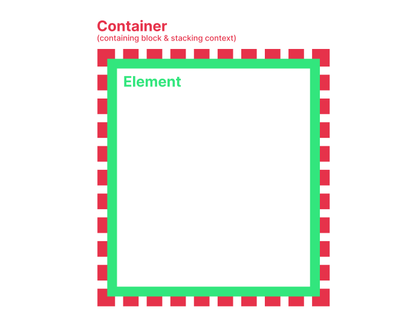

# Layout

Animations of every [Module](/usage/modules) have the same base layout consisting of an **Element** and a **Container**.

## Element

**Element** is an [`Element`](https://developer.mozilla.org/en-US/docs/Web/API/Element) animation currently executes for.
The Element is what an animation should make appear (`enter`) or disappear (`exit`).
All visual styles should be applied to the **Element**.

What the **Element** exactly is depends on a [Module](/usage/modules) — Tooltip, Popout, Message, etc.
However, for most of the Animations, what the **Element** is doesn't matter, with the exception being the Animations
made for a specific Module, most commonly for [Backdrop](/usage/modules#modals-backdrop).

To get the reference to the **Element** use inject <InjectRef inject="element" />:
```json
{
  "key": "myAnimation",
  "name": "My Animation",
  "animate": {
    "anime": { // [!code focus:4]
      "targets": { "inject": "element" }, // [!code highlight]
      "parameters": { /* ... */ }
    }
  }
}
```

## Container

**Container** is an [`Element`](https://developer.mozilla.org/en-US/docs/Web/API/Element) that wraps the [**Element**](#element):



It exists for multiple purposes:
- To have a strictly defined [Containing block](https://developer.mozilla.org/en-US/docs/Web/CSS/CSS_display/Containing_block) and [Stacking context](https://developer.mozilla.org/en-US/docs/Web/CSS/CSS_positioned_layout/Stacking_context).
- To implement [Overflow](/usage/advanced-animation-settings#overflow) setting by applying [`clip`](https://developer.mozilla.org/en-US/docs/Web/CSS/overflow#clip)
  to [`overflow`](https://developer.mozilla.org/en-US/docs/Web/CSS/overflow) property when disabled.
- To make [Accordion Animations](./accordions) without interfering with [**Element**](#element)'s position and size.

To get the reference to the **Container** use inject <InjectRef inject="container" />:
```json
{
  "key": "myAnimation",
  "name": "My Animation",
  "animate": {
    "anime": { // [!code focus:4]
      "targets": { "inject": "container" }, // [!code highlight]
      "parameters": { /* ... */ }
    }
  }
}
```

## Hast

_BetterAnimations_ allows Animations to create additional custom elements required for animations by defining them
in [Hast](https://github.com/syntax-tree/hast) (**H**ypertext **A**bstract **S**yntax **T**ree) format inside [`hast`](/reference/animate#hast) property of [Animate](/reference/animate) as such:
```json
{
  "key": "myAnimation",
  "name": "My Animation",
  "animate": {
    "hast": { // [!code focus:27] [!code highlight:23]
      "type": "element",
      "tagName": "svg",
      "properties": {
        "className": "overlay",
        "width": "100%",
        "height": "100%",
        "viewBox": "0 0 100 100",
        "preserveAspectRatio": "none"
      },
      "children": [
        {
          "type": "element",
          "tagName": "path",
          "properties": {
            "className": "overlay__path",
            "vectorEffect": "non-scaling-stroke",
            "d": "M 0 0 h 0 c 0 50 0 50 0 100 H 0 V 0 Z",
            "fill": "white"
          }
        }
      ]
    },
    "anime": {
      "targets": { "inject": "element" },
      "parameters": { /* ... */ }
    }
  }
}
```

This definition will be transformed into the following HTML:
```html
<svg
  class="overlay"
  width="100%"
  height="100%"
  viewBox="0 0 100 100"
  preserveAspectRatio="none"
>
  <path
    class="overlay__path"
    vector-effect="non-scaling-stroke"
    d="M 0 0 h 0 c 0 50 0 50 0 100 H 0 V 0 Z"
    fill="white"
  />
</svg>
```

All the **root** elements defined inside [`hast`](/reference/animate#hast) will have [`position`](https://developer.mozilla.org/en-US/docs/Web/CSS/position) property assigned to [`absolute`](https://developer.mozilla.org/en-US/docs/Web/CSS/position#absolute) by default
and will be mounted **inside** the [Container](#container) **before** the [Element](#element) while the Animation is alive:
```md
Container
├── Hast Element 1
├── Hast Element 2
├── Hast Element 3
└── Element
```

> [!WARNING]
> Provided hast elements are sanitized before being inserted into DOM. See [sanitization schema](https://github.com/arg0NNY/BetterAnimations/blob/main/shared/animation/hastSanitizeSchema.js).

To get the reference to the created Hast elements, use inject <InjectRef inject="hast" />:
```json
{
  "key": "myAnimation",
  "name": "My Animation",
  "animate": {
    "anime": { // [!code focus:4]
      "targets": { "inject": "hast", "selector": ".overlay" }, // [!code highlight]
      "parameters": { /* ... */ }
    }
  }
}
```

> [!TIP]
> `targets` accepts strings as selectors to target the created Hast elements. See [Targets](./anime#targets).
> 
> The equivalent to the code above is:
> ```json
> {
>   "key": "myAnimation",
>   "name": "My Animation",
>   "animate": {
>     "anime": { // [!code focus:4]
>       "targets": ".overlay", // [!code highlight]
>       "parameters": { /* ... */ }
>     }
>   }
> }
> ```

## CSS

_BetterAnimations_ allows Animations to mount custom CSS while alive by defining it as a representative object
inside [`css`](/reference/animate#css) property of [Animate](/reference/animate) as such:
```json
{
  "key": "myAnimation",
  "name": "My Animation",
  "animate": {
    "hast": [ // [!code focus:30]
      {
        "type": "element",
        "tagName": "div",
        "properties": {
          "className": "some-class"
        }
      },
      {
        "type": "element",
        "tagName": "div",
        "properties": {
          "className": "some-additional-class"
        }
      }
    ],
    "css": { // [!code highlight:10]
      ".some-class": {
        "background-color": "#FFF",
        "border-radius": "50%"
      },
      ".some-additional-class": {
        "inset": 0,
        "top": "20px"
      }
    },
    "anime": {
      "targets": ".some-class",
      "parameters": { /* ... */ }
    }
  }
}
```

This definition will be transformed into the following CSS:
```css
.some-class {
    background-color: #FFF;
    border-radius: 50%;
}
.some-additional-class {
    inset: 0;
    top: 20px;
}
```

**Selectors inside [`css`](/reference/animate#css) can only target the elements defined inside [`hast`](#hast).**
Use `{element}` and `{container}` to target an [Element](#element) and a [Container](#container) correspondingly:
```json
{
  "{element}": {
    "transform-origin": { "inject": "position" }
  },
  "{container}": {
    "z-index": 1
  }
}
```

## Switch Animations

**Enter** and **Exit** animations executing simultaneously in the scope of the same [Module](/usage/modules)
of type _Switch_ share the same **Switch Container**:
```md
Switch Container
├── Container (Enter)
│   ├── Hast Element 1
│   ├── Hast Element 2
│   ├── Hast Element 3
│   └── Element
└── Container (Exit)
    ├── Hast Element 1
    ├── Hast Element 2
    ├── Hast Element 3
    └── Element
```

It cannot be accessed by either of the animations as it is used only to isolate the animations
by creating a [Containing block](https://developer.mozilla.org/en-US/docs/Web/CSS/CSS_display/Containing_block) and a [Stacking context](https://developer.mozilla.org/en-US/docs/Web/CSS/CSS_positioned_layout/Stacking_context),
just like the regular [Container](#container).

**Switch Container**, **Container (Enter)** and **Container (Exit)** all share the same position and size.
However, **Container (Exit)** has property [`z-index`](https://developer.mozilla.org/en-US/docs/Web/CSS/z-index) assigned to `1` by default to always overlap the **Container (Enter)**.

If you want to make **Container (Enter)** overlap **Container (Exit)** instead alter the [`z-index`](https://developer.mozilla.org/en-US/docs/Web/CSS/z-index) property of the [Container](#container)
using the `{container}` selector inside [custom CSS](#css) as such:
```json
{
  "css": {
    "{container}": {
      "z-index": {
        "inject": "type",
        "enter": 2,
        "exit": 1
      }
    }
  }
}
```

## Inject restrictions

[`hast`](/reference/animate#hast) and [`css`](/reference/animate#css) properties of [Animate](/reference/animate)
have a limited set of injects that are allowed for use inside them:
- <InjectRef inject="anchor" />
- <InjectRef inject="container" />
- <InjectRef inject="element" />
- <InjectRef inject="hast" />
- <InjectRef inject="if" />
- <InjectRef inject="isIntersected" />
- <InjectRef inject="module" />
- <InjectRef inject="module.type" />
- <InjectRef inject="mouse" />
- <InjectRef inject="raw" />
- <InjectRef inject="rect" />
- <InjectRef inject="string.template" />
- <InjectRef inject="switch" />
- <InjectRef inject="type" />
- <InjectRef inject="undefined" />
- <InjectRef inject="var.get" />
- <InjectRef inject="window" />
- <InjectRef inject="assign" />
- <InjectRef inject="includes" />
- <InjectRef inject="utils.get" />
- <InjectRef inject="utils.random" />
- <InjectRef inject="direction" />
- <InjectRef inject="duration" />
- <InjectRef inject="easing" />
- <InjectRef inject="position" />
- <InjectRef inject="variant" />
- <InjectRef inject="math.abs" />
- <InjectRef inject="math.acos" />
- <InjectRef inject="math.acosh" />
- <InjectRef inject="math.asin" />
- <InjectRef inject="math.asinh" />
- <InjectRef inject="math.atan2" />
- <InjectRef inject="math.atan" />
- <InjectRef inject="math.atanh" />
- <InjectRef inject="math.cbrt" />
- <InjectRef inject="math.ceil" />
- <InjectRef inject="math.clz32" />
- <InjectRef inject="math.cos" />
- <InjectRef inject="math.cosh" />
- <InjectRef inject="math.E" />
- <InjectRef inject="math.exp" />
- <InjectRef inject="math.expm1" />
- <InjectRef inject="math.floor" />
- <InjectRef inject="math.fround" />
- <InjectRef inject="math.hypot" />
- <InjectRef inject="math.imul" />
- <InjectRef inject="math" />
- <InjectRef inject="math.LN10" />
- <InjectRef inject="math.LN2" />
- <InjectRef inject="math.LOG10E" />
- <InjectRef inject="math.LOG2E" />
- <InjectRef inject="math.log10" />
- <InjectRef inject="math.log1p" />
- <InjectRef inject="math.log2" />
- <InjectRef inject="math.log" />
- <InjectRef inject="math.max" />
- <InjectRef inject="math.min" />
- <InjectRef inject="math.PI" />
- <InjectRef inject="math.pow" />
- <InjectRef inject="math.random" />
- <InjectRef inject="math.round" />
- <InjectRef inject="math.SQRT1_2" />
- <InjectRef inject="math.SQRT2" />
- <InjectRef inject="math.sign" />
- <InjectRef inject="math.sin" />
- <InjectRef inject="math.sinh" />
- <InjectRef inject="math.sqrt" />
- <InjectRef inject="math.tan" />
- <InjectRef inject="math.tanh" />
- <InjectRef inject="math.trunc" />
- <InjectRef inject="+" />
- <InjectRef inject="/" />
- <InjectRef inject="==" />
- <InjectRef inject=">" />
- <InjectRef inject=">=" />
- <InjectRef inject="in" />
- <InjectRef inject="!=" />
- <InjectRef inject="<" />
- <InjectRef inject="<=" />
- <InjectRef inject="&&" />
- <InjectRef inject="!" />
- <InjectRef inject="||" />
- <InjectRef inject="*" />
- <InjectRef inject="??" />
- <InjectRef inject="%" />
- <InjectRef inject="===" />
- <InjectRef inject="!==" />
- <InjectRef inject="-" />
- <InjectRef inject="snippet" />
- <InjectRef inject="snippet.params" />
