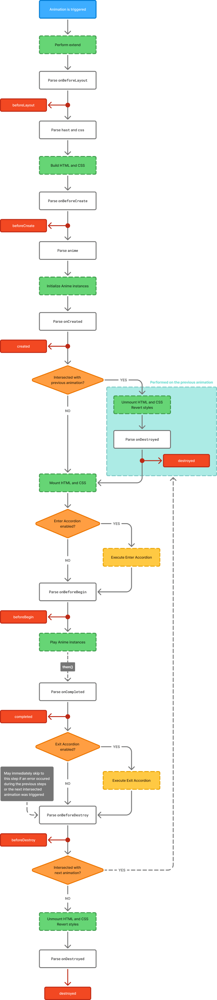

# Lifecycle

Each Animation instance goes through a series of various parse stages and actions while alive.
Along the way, it also executes callbacks — lifecycle hooks, giving the opportunity to add callbacks at specific stages.

## Lifecycle Diagram

Below is a diagram for the Animation lifecycle.

Most of the steps you should already be familiar with. However, there are steps that weren't covered yet:
- **Perform extend:** Executes the process of extension. This step will be skipped entirely if the Animation doesn't have property [`extends`](/reference/animate#extends).
  See [Extending Animations](./extending-animations).
- **Intersections:** Animation can be intersected with itself. The details on when the intersection happens
  and how to handle it are described at [Intersection](./intersection).
- **Accordions:** _Accordions_ are [Expand/Collapse Animations](/usage/basics#expand-collapse-animations).
  They don't require any extra effort on the Animation's side under normal circumstances. Accordions are covered in detail at [Accordions](./accordions).

---



## Lifecycle Hooks

[Animate](/reference/animate) provides `on*` properties for Animations to add callbacks when specific hooks trigger.

For example, to assign callbacks to `beforeCreate` hook, pass an array of or a single function ([_lazy inject_](./injects#lazy-injects))
to `onBeforeCreate` property:
```json
{
  "key": "myAnimation",
  "name": "My Animation",
  "animate": {
    "onBeforeCreate": [ // [!code focus:19] [!code highlight:15]
      {
        "inject": "var.set",
        "name": "zIndex",
        "value": {
          "inject": "type",
          "enter": 5,
          "exit": 10
        }
      },
      {
        "inject": "debug",
        "data": "onBeforeCreate triggered!"
      }
    ],
    "anime": {
      "targets": { "inject": "element" },
      "parameters": { /* ... */ }
    }
  }
}
```

For the example above, when the Animation instance reaches the `beforeCreate` step in its [lifecycle](#lifecycle-diagram),
it will execute the provided callbacks in their original order. 

That means if you try to get the value of `zIndex` variable before the Animation has reached `beforeCreate`, you'll get `undefined` since the value has not been assigned yet:
```json
{
  "key": "myAnimation",
  "name": "My Animation",
  "animate": {
    "css": { // [!code focus:24] [!code highlight:5]
      "{container}": {
        "z-index": { "inject": "var.get", "name": "zIndex" } // Returns `undefined`
      }
    },
    "onBeforeCreate": [
      {
        "inject": "var.set",
        "name": "zIndex",
        "value": {
          "inject": "type",
          "enter": 5,
          "exit": 10
        }
      },
      {
        "inject": "debug",
        "data": "onBeforeCreate triggered!"
      }
    ],
    "anime": {
      "targets": { "inject": "element" },
      "parameters": { /* ... */ }
    }
  }
}
```

To fix the issue in the case above, move `var.set` callback to `beforeLayout` hook, which triggers before `css` is parsed (see [Diagram](#lifecycle-diagram)):
```json
{
  "key": "myAnimation",
  "name": "My Animation",
  "animate": {
    "onBeforeLayout": { // [!code focus:33] [!code ++:9]
      "inject": "var.set",
      "name": "zIndex",
      "value": {
        "inject": "type",
        "enter": 5,
        "exit": 10
      }
    },
    "css": {
      "{container}": {
        "z-index": { "inject": "var.get", "name": "zIndex" } // Returns `5` or `10` [!code highlight]
      }
    },
    "onBeforeCreate": [
      { // [!code --:9]
        "inject": "var.set",
        "name": "zIndex",
        "value": {
          "inject": "type",
          "enter": 5,
          "exit": 10
        }
      },
      {
        "inject": "debug",
        "data": "onBeforeCreate triggered!"
      }
    ],
    "anime": {
      "targets": { "inject": "element" },
      "parameters": { /* ... */ }
    }
  }
}
```

> [!TIP]
> Hooks are not strictly bound to [_lazy injects_](./injects#lazy-injects), they can also accept any [trusted function](./parsing#trusted-functions).
> 
> For example, inject <InjectRef inject="utils.set" /> returns a callback function that reverts styles to their original state.
> We may save this callback using inject <InjectRef inject="var.set" /> and pass it to the `destroyed` hook using inject <InjectRef inject="var.get" />:
> ```json
> {
>   "key": "myAnimation",
>   "name": "My Animation",
>   "animate": {
>     "onBeforeBegin": { // [!code focus:16] [!code highlight:8]
>       "inject": "var.set",
>       "name": "revert",
>       "value": {
>         "inject": "utils.set",
>         "properties": { "pointer-events": "none" }
>       }
>     },
>     "anime": {
>       "targets": { "inject": "element" },
>       "parameters": { /* ... */ }
>     },
>     "onDestroyed": { // [!code highlight:4]
>       "inject": "var.get",
>       "name": "revert"
>     }
>   }
> }
> ```
>
> However, if you try to execute the animation above, you'll end up seeing <InjectRef inject="utils.set" /> execute on `destroyed` hook instead of on `beforeBegin`.
> That happens because <InjectRef inject="utils.set" />, just like <InjectRef inject="var.set" />, is a [_lazy inject_](./injects#lazy-injects) — it transforms into a function and parses its contents only when this function is called.
> So what we essentially ended up doing in the example above is storing the `utils.set` itself, not the callback it returns.
> 
> To fix this issue, we can immediately call it while parsing using inject <InjectRef inject="call" /> as such:
> ```json
> {
>   "key": "myAnimation",
>   "name": "My Animation",
>   "animate": {
>     "onBeforeBegin": { // [!code focus:23]
>       "inject": "var.set",
>       "name": "revert",
>       "value": { // [!code --:4]
>         "inject": "utils.set",
>         "properties": { "pointer-events": "none" }
>       },
>       "value": { // [!code ++:7]
>         "inject": "call",
>         "function": {
>           "inject": "utils.set",
>           "properties": { "pointer-events": "none" }
>         }
>       }
>     },
>     "anime": {
>       "targets": { "inject": "element" },
>       "parameters": { /* ... */ }
>     },
>     "onDestroyed": {
>       "inject": "var.get",
>       "name": "revert"
>     }
>   }
> }
> ```
