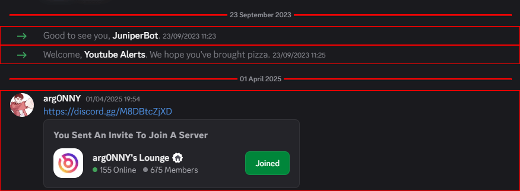

# Peculiarities

This page describes the specifics of creating Animations for different [Modules](/usage/modules).

## Modals Backdrop

[**Modals -> Backdrop**](/usage/modules#modals-backdrop) is the only [Module](/usage/modules) that allows the animations to alter the static styles
of the [Element](./layout#element). This means that you can preserve the styles you applied whilst animating
to create different looks for the backdrop.

However, you need to explicitly state that your Animation will apply the custom styles
by disabling the automatic reverting using the [`revert`](/reference/meta#revert) property of [Meta](/reference/meta):
```json
{
  "key": "myAnimation",
  "name": "My Animation",
  "modules": "modalsBackdrop",
  "meta": { // [!code ++:3]
    "revert": false
  },
  "animate": {
    "anime": {
      "targets": { "inject": "element" },
      "parameters": { /* ... */ }
    }
  }
}
```

Here is an example Backdrop Animation that adds a simple blur effect alongside the default dimming of the background:
```json
{
  "key": "backdropBlur",
  "name": "Blur",
  "modules": "modalsBackdrop",
  "meta": {
    "revert": false
  },
  "settings": {
    "duration": true,
    "easing": true,

    "defaults": {
      "duration": 200,
      "easing": {
        "type": "ease",
        "style": "quart"
      }
    }
  },
  "animate": {
    "anime": {
      "type": "waapi",
      "targets": { "inject": "element" },
      "parameters": {
        "duration": { "inject": "duration" },
        "ease": { "inject": "easing" },
        "background": {
          "inject": "type",
          "enter": {
            "inject": "isIntersected",
            "true": "rgba(0, 0, 0, .7)",
            "false": ["rgba(0, 0, 0, 0)", "rgba(0, 0, 0, .7)"]
          },
          "exit": "rgba(0, 0, 0, 0)"
        },
        "backdropFilter": { // [!code highlight:9]
          "inject": "type",
          "enter": {
            "inject": "isIntersected",
            "true": "blur(2px)",
            "false": ["blur(0px)", "blur(2px)"]
          },
          "exit": "blur(0px)"
        }
      }
    }
  }
}
```

## Messages

As stated in [Modules](/usage/modules#messages) — [Messages](/usage/modules#messages) Animations also animate other UI elements in the chat,
which includes the _dividers_: date divider, new messages divider, etc.

Take a look at this screenshot of the chat:


There, highlighted in red, are the [Containers](./layout#container) that are animated by the [Messages](/usage/modules#messages).

Notice something strange? Yep, the [Containers](./layout#container) of the _dividers_ are actually 1 pixel in height,
which makes the text of the divider itself to overflow the container.
Make sure to account for this beauty of Discord's layout when making the Animations for [Messages](/usage/modules#messages).
