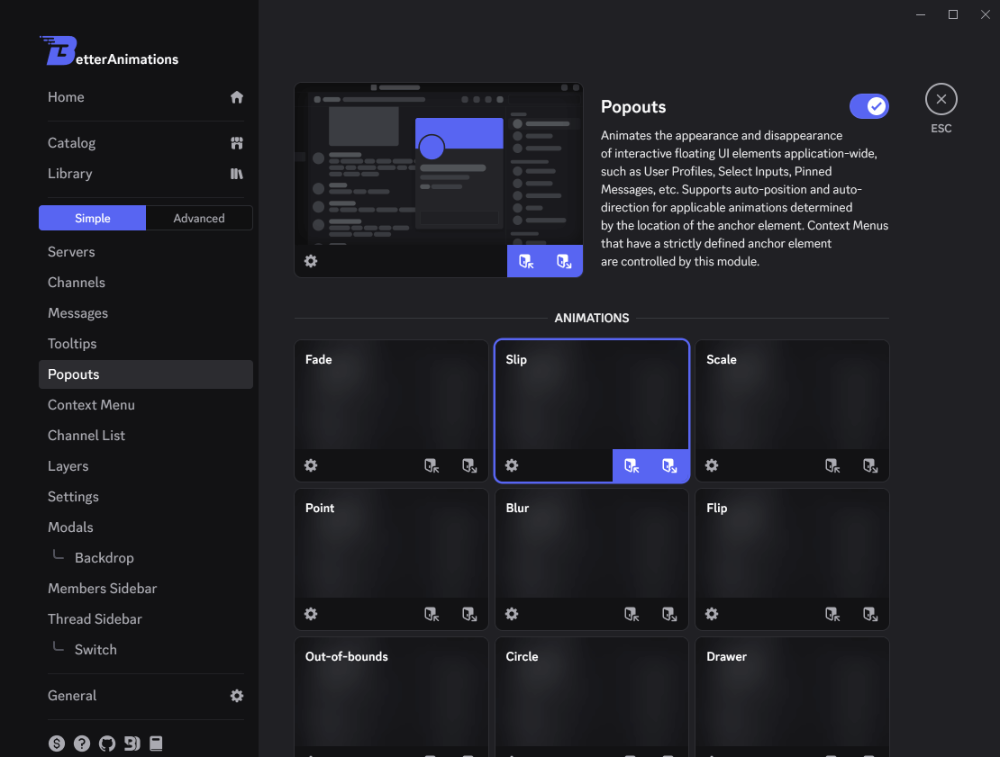

# Basics

There are two entities layering out the fundament of _BetterAnimations_: **Animations** and&nbsp;**Modules**.

## Animations

Animation describes **how** the element should appear or disappear.

Every Animation consists of two animations of different types: **Enter** and **Exit**.

    <svg width="20" height="20" xmlns="http://www.w3.org/2000/svg" fill="none" viewBox="0 0 24 24" style="display: inline; vertical-align: sub;">
        <path fill="currentColor" d="M9 12a1 1 0 0 1 1 1v2a1 1 0 1 1-2 0v-2a1 1 0 0 1 1-1Z"></path><path fill="currentColor" fill-rule="evenodd" d="M2.75 3.02A3 3 0 0 1 5 2h10a3 3 0 0 1 3 3v7.5a.5.5 0 0 1-.5.5H16a3 3 0 0 0-3 3v3.5a2.5 2.5 0 0 1-3.68 2.2l-5.8-3.09A3 3 0 0 1 2 16V5a3 3 0 0 1 .76-1.98Zm1.3 1.95A.04.04 0 0 0 4 5v11c0 .36.2.68.49.86l5.77 3.08a.5.5 0 0 0 .74-.44V8.02a.5.5 0 0 0-.32-.46l-6.63-2.6Z" clip-rule="evenodd"></path><path fill="currentColor" d="M15 18.5V22a1 1 0 1 0 2 0v-3.59l4.3 4.3a1 1 0 0 0 1.4-1.42L18.42 17H22a1 1 0 1 0 0-2h-6a1 1 0 0 0-1 1v2.5Z"></path>
    </svg> <b>Enter</b> animation animates the appearance of the element.

    <svg width="20" height="20" xmlns="http://www.w3.org/2000/svg" fill="none" viewBox="0 0 24 24" style="display: inline; vertical-align: sub;">
        <path fill="currentColor" d="M9 12a1 1 0 0 1 1 1v2a1 1 0 1 1-2 0v-2a1 1 0 0 1 1-1Z"></path><path fill="currentColor" fill-rule="evenodd" d="M2.75 3.02A3 3 0 0 1 5 2h10a3 3 0 0 1 3 3v7.64c0 .44-.55.7-.95.55a3 3 0 0 0-3.17 4.93l.02.03a.5.5 0 0 1-.35.85h-.05a.5.5 0 0 0-.5.5 2.5 2.5 0 0 1-3.68 2.2l-5.8-3.09A3 3 0 0 1 2 16V5a3 3 0 0 1 .76-1.98Zm1.3 1.95A.04.04 0 0 0 4 5v11c0 .36.2.68.49.86l5.77 3.08a.5.5 0 0 0 .74-.44V8.02a.5.5 0 0 0-.32-.46l-6.63-2.6Z" clip-rule="evenodd"></path><path fill="currentColor" d="M15.3 16.7a1 1 0 0 1 1.4-1.4l4.3 4.29V16a1 1 0 1 1 2 0v6a1 1 0 0 1-1 1h-6a1 1 0 1 1 0-2h3.59l-4.3-4.3Z"></path>
    </svg> <b>Exit</b> animation animates the disappearance of the element.

<Lottie :animation-data="enterExit" />

## Modules

Modules control the Animations for specific parts of Discord.

There is a bunch of modules supported by _BetterAnimations_: Servers, Channels, Popouts, Messages, etc.
See [the full list of Modules](./modules).

However, every one of them has a type, and there are only two types of Modules: **Reveal** and **Switch**.

### Reveal

Reveal modules animate the elements that appear and disappear.
For example, [_Popouts_](./modules#popouts) executes an animation when you open or close a popout by hovering or clicking some anchor element,
such as User Card in the Member List; [_Messages_](./modules#messages) executes an animation when a new message is sent into the channel or is deleted from it,
and so on.

<Lottie :animation-data="reveal" style="max-width: 450px;" />

### Switch

Switch modules animate the switch between elements (pages) sharing the same container.
For example, [_Servers_](./modules#servers) executes an animation when you switch from one Discord server to another;
[_Settings_](./modules#settings) executes an animation when you switch between different sections of the settings, etc.

<Lottie :animation-data="_switch" style="max-width: 450px;" />

## Selecting Animations

To select an Animation, you can click the card of the Animation you wish to choose inside the Module Settings you wish to choose it for.
This will apply both Enter and Exit animations of this Animation.

If you wish to choose different Animations for Enter and Exit, you can click the corresponding switch in the bottom-right corner of the Animation Card.

> [!IMPORTANT]
> Switch Modules don't allow choosing different Animations or configure them differently for Enter and Exit in the Simple Mode
> for the sake of simplicity. Turn on the [Advanced Mode](./advanced-mode) to disable this restriction.
> 
> Learn more about Animations for Switch Modules at [Switch Animations In-depth](./switch-animations).

## Configuring Animations

Most of the Animations are configurable. To open the Animation Settings click the
<svg width="20" height="20" xmlns="http://www.w3.org/2000/svg" fill="none" viewBox="0 0 24 24" style="display: inline; vertical-align: sub;">
    <path fill="currentColor" fill-rule="evenodd" d="M10.56 1.1c-.46.05-.7.53-.64.98.18 1.16-.19 2.2-.98 2.53-.8.33-1.79-.15-2.49-1.1-.27-.36-.78-.52-1.14-.24-.77.59-1.45 1.27-2.04 2.04-.28.36-.12.87.24 1.14.96.7 1.43 1.7 1.1 2.49-.33.8-1.37 1.16-2.53.98-.45-.07-.93.18-.99.64a11.1 11.1 0 0 0 0 2.88c.06.46.54.7.99.64 1.16-.18 2.2.19 2.53.98.33.8-.14 1.79-1.1 2.49-.36.27-.52.78-.24 1.14.59.77 1.27 1.45 2.04 2.04.36.28.87.12 1.14-.24.7-.95 1.7-1.43 2.49-1.1.8.33 1.16 1.37.98 2.53-.07.45.18.93.64.99a11.1 11.1 0 0 0 2.88 0c.46-.06.7-.54.64-.99-.18-1.16.19-2.2.98-2.53.8-.33 1.79.14 2.49 1.1.27.36.78.52 1.14.24.77-.59 1.45-1.27 2.04-2.04.28-.36.12-.87-.24-1.14-.96-.7-1.43-1.7-1.1-2.49.33-.8 1.37-1.16 2.53-.98.45.07.93-.18.99-.64a11.1 11.1 0 0 0 0-2.88c-.06-.46-.54-.7-.99-.64-1.16.18-2.2-.19-2.53-.98-.33-.8.14-1.79 1.1-2.49.36-.27.52-.78.24-1.14a11.07 11.07 0 0 0-2.04-2.04c-.36-.28-.87-.12-1.14.24-.7.96-1.7 1.43-2.49 1.1-.8-.33-1.16-1.37-.98-2.53.07-.45-.18-.93-.64-.99a11.1 11.1 0 0 0-2.88 0ZM16 12a4 4 0 1 1-8 0 4 4 0 0 1 8 0Z" clip-rule="evenodd"></path>
</svg>
icon in the bottom-left corner of the Animation Card
or simply right-click the card.

_BetterAnimations_ provides the following settings to configure the Animations:
- Duration
- Position
- Direction
- Easing*
- Overflow*

Learn more about each setting at [Animation Settings](./animation-settings).

> \* - available only in [Advanced Mode](./advanced-mode).

> [!NOTE]
> The Animation Card in the header of the Module Settings provides the settings for the currently selected Animations inside the corresponding Module.

## Expand/Collapse Animations

**Expand/Collapse Animations** is an internal Animation that executes before Enter animation (**Expand**) or after Exit animation (**Collapse**).

**Expand** animation smoothly takes up the required space for the element when it appears.
For example, when a new message is sent in the channel it smoothly pushes all the messages above it before executing the Enter animation to avoid the sudden shift.

**Collapse** animation smoothly shrinks the space that has been occupied by the disappearing element.
For example, when a message is deleted from the channel it smoothly shrinks the gap between the message above and the message below after Exit animation ends, once again, to avoid the sudden shift.

<Lottie :animation-data="expandCollapse" />

To configure the **Expand/Collapse Animations**, click the
<svg width="24" height="24" xmlns="http://www.w3.org/2000/svg" fill="none" viewBox="0 0 24 24" style="display: inline; vertical-align: sub;">
    <path fill="currentColor" fill-rule="evenodd" d="M7.3 2.3a1 1 0 0 1 1.4 0L12 5.58l3.3-3.3a1 1 0 1 1 1.4 1.42l-4 4a1 1 0 0 1-1.4 0l-4-4a1 1 0 0 1 0-1.42ZM2 12a1 1 0 0 1 1-1h18a1 1 0 1 1 0 2H3a1 1 0 0 1-1-1ZM8.7 21.7a1 1 0 0 1-1.4-1.4l4-4a1 1 0 0 1 1.4 0l4 4a1 1 0 0 1-1.4 1.4L12 18.42l-3.3 3.3Z" clip-rule="evenodd"></path>
</svg>
icon in the bottom-left corner of the Animation Card in the header of the Module Settings.

Modules supporting **Expand/Collapse Animations**: [_Messages_](./modules#messages), [_Channel List_](./modules#channel-list), [_Members Sidebar_](./modules#members-sidebar), [_Thread Sidebar_](./modules#thread-sidebar).

> [!NOTE]
> Some Animations may forcefully disable internal **Expand/Collapse Animations** if they implement them themselves.