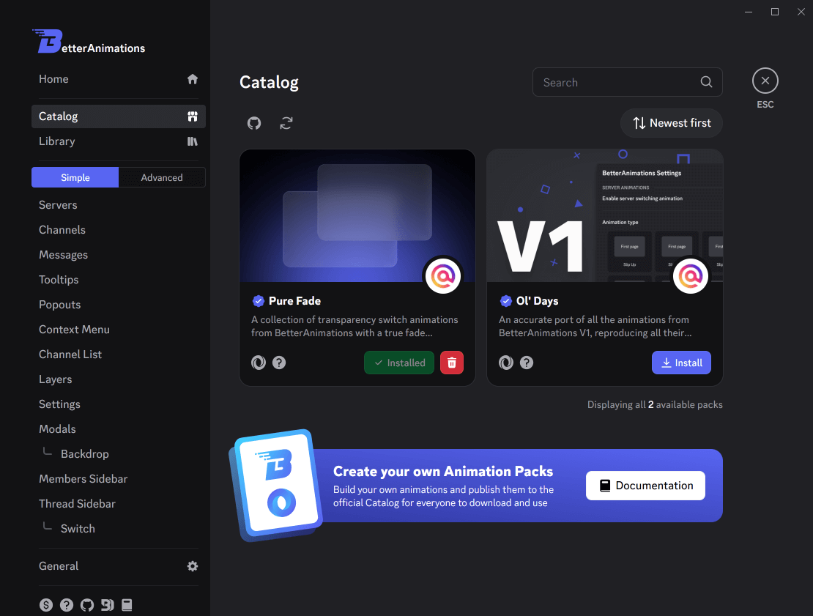
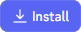
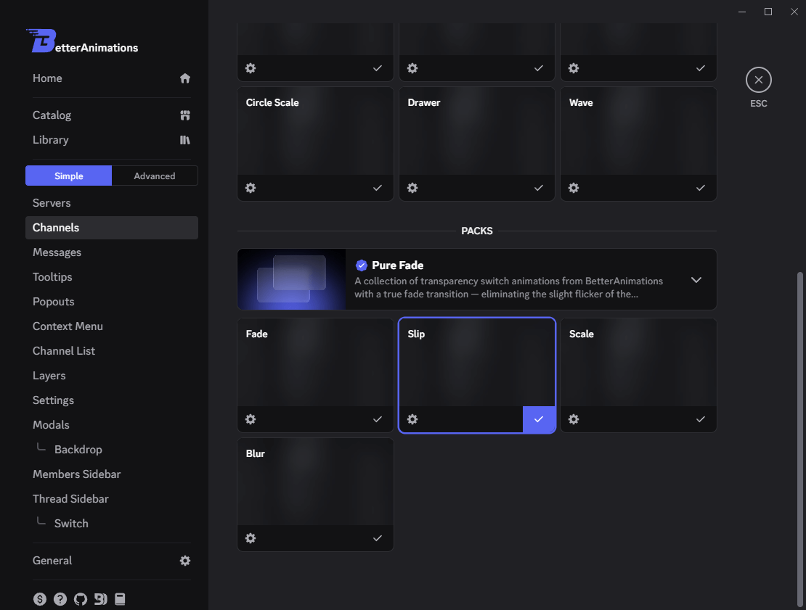

# Packs

Packs are collections of Animations.

> [!NOTE]
> Internal Animations that come preinstalled with _BetterAnimations_ are also a part of a pack.
> See [source code](https://github.com/arg0NNY/BetterAnimations/blob/main/shared/packs/preinstalled.pack.json).

## Catalog & Library

**Catalog & Library** allow you to browse, install and manage official and verified community-made packs
right within the plugin settings.

To install a pack, click on the  button
in the pack card. After the pack is installed, its animations will be available for selection at the bottom of the module settings.

> [!TIP]
> To learn how to manually manage the packs, see [Pack Directory](./pack-directory).
